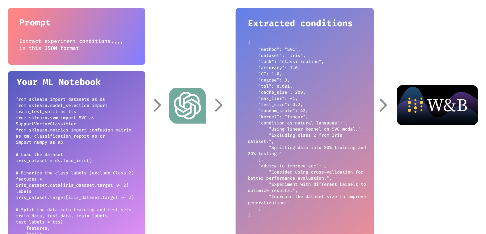

<div align="center">

[🌐 **Project Website**](https://logllm.tiiny.site/) | [💬 **Discord Community**](https://discord.gg/3xvUV6xcKW)

# 🚀 **LogLLM** 🚀

**LLM-Enhanced ML Experiment Logging System**

`Ever found yourself lost in a maze of changing experiment conditions in your early ML scripts? 😵 No worries—here’s the solution you’ve been looking for! ✨`




</div>

---

## ✨ **Features**

**🔍 Automatic Logging**: Effortlessly extracts code from Jupyter Notebook files using GPT4o, saving the logs to Weights & Biases (W&B) for seamless tracking and analysis.

**💬 Natural Language Queries**: Effortlessly extract and display information from WandB logs using natural language queries. Simply ask in plain language, and get insights directly. For example, you could ask, "What was the most effective method using decision trees so far?" and receive the relevant data instantly.

## ⚙️ **Installation**

To install the package, run the following command in your terminal:

```bash
git clone https://github.com/shure-dev/logllm.git
pip install -e .
```

```bash
export OPENAI_API_KEY="your-openai-api-key" or export GOOGLE_API_KEY="your-google-api-key"

wandb login
```

This command installs the package in editable mode, allowing you to modify the code and see changes without reinstalling.


## 🚀 **Usage**

Here’s a simplified example of how to use the package:

### 🔍 Automatic Logging

**Sample Notebook Script: `sample-script.ipynb`**

```python
###
# Your machine learning script goes here.
# Experimental conditions are extracted from here.
###

from logllm import log_llm

notebook_path = "sample-script.ipynb"  # The target file to log

log_llm(notebook_path)
```

### 💬 Natural Language Queries
- developing now,,,


## 🧠 **How It Works: Simple and Powerful!**

**LLM**(`Our Prompt` + `Your ML Script`) = `Extracted Experimental Conditions`

### **Our Prompt:**

```plaintext
You are an advanced machine learning experiment designer.
Extract all experimental conditions and results for logging via W&B API.
Add your original parameters in your JSON response if you want to log other parameters.
Extract all information you can find in the given script as int, bool, or float values.
If you cannot describe conditions with int, bool, or float values, use a list of natural language.
Give advice to improve accuracy.
If you use natural language, answers should be very short.
Do not include information already provided in param_name_1 for `condition_as_natural_langauge`.
Output JSON schema example:
This is just an example, make changes as you see fit.
{{
    "method": "str",
    "dataset": "str",
    "task": "str",
    "is_advanced_method": bool,
    "is_latest_method": "",
    "accuracy": "",
    "other_param_here": "",
    "other_param_here": "",
    ...
    "condition_as_natural_langauge": ["Small dataset."],
    "advice_to_improve_acc": ["Use a bigger dataset.", "Use a simpler model."]
}}
```

### **Your ML Script: `svc-sample.ipynb`**

```python
from sklearn import datasets
from sklearn.model_selection import train_test_split
from sklearn.svm import SVC
from sklearn.metrics import accuracy_score

iris = datasets.load_iris()

X = iris.data[iris.target != 2]
y = iris.target[iris.target != 2]

X_train, X_test, y_train, y_test = train_test_split(X, y, test_size=0.2, random_state=42)

model = SVC(kernel='linear')
model.fit(X_train, y_train)

y_pred = model.predict(X_test)
accuracy = accuracy_score(y_test, y_pred)

print(f"Accuracy: {accuracy:.2f}")
```

### **Extracted Experimental Conditions:**

```json
{
    "method": "SVC",
    "dataset": "Iris",
    "task": "classification",
    "is_advanced_method": false,
    "is_latest_method": "",
    "accuracy": 1.00,
    "kernel": "linear",
    "test_size": 0.2,
    "random_state": 42,
    "condition_as_natural_langauge": [
        "Using linear kernel on SVC model.",
        "Excluding class 2 from Iris dataset.",
        "Splitting data into 80% training and 20% testing."
    ],
    "advice_to_improve_acc": [
        "Confirm dataset consistency.",
        "Consider cross-validation for validation."
    ]
}
```

### **Plotting Compared Metrics**


```python
from logllm.log_llm import log_llm
from logllm.plot import plot_metrics
from logllm.plot_v1 import plot_ml_metrics

# code_string = extract_notebook_code(notebook_path)
notebook_path = "svc-sample.ipynb" 
notebook_path2 = "train.ipynb"
notebook_path3 = "cal.ipynb"

# Extract experimental conditions and results using log_llm
code_string = log_llm(notebook_path, provider="gemini")
code_strin2 = log_llm(notebook_path2, provider="gemini")
code_string3 = log_llm(notebook_path3, provider="gemini")


# Plot the response from the query
plot_metrics(code_string, code_string2, code_string3)
```


[📄 **Check the Demo Code**](https://github.com/shure-dev/logllm/blob/main/demos/svc-sample.ipynb)

---

## 🤝 **Contributing**

Contributions are welcome! If you have suggestions or improvements, please feel free to submit an issue or a pull request.

## 📜 **License**

This project is licensed under the **MIT License**.
